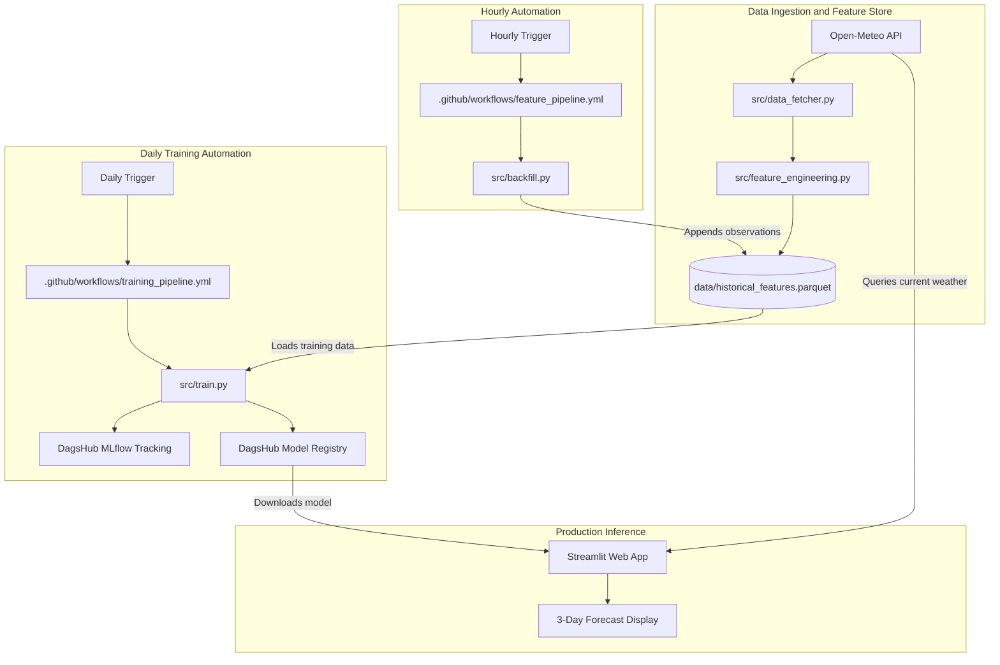
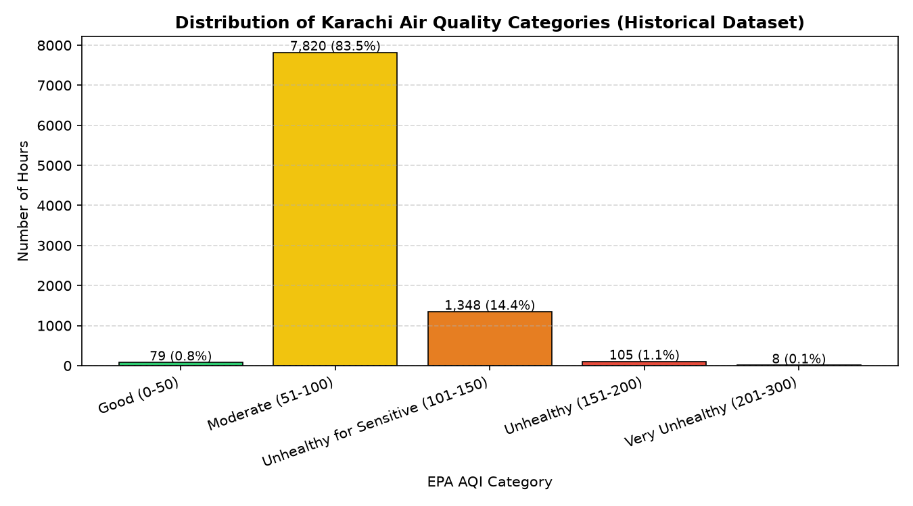
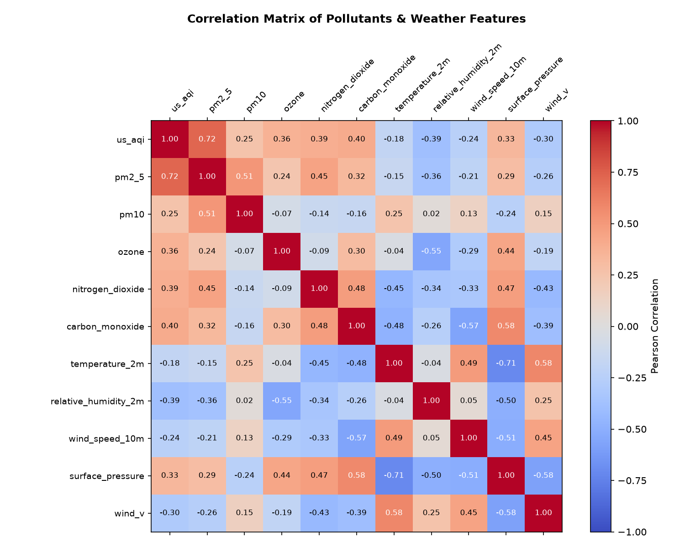
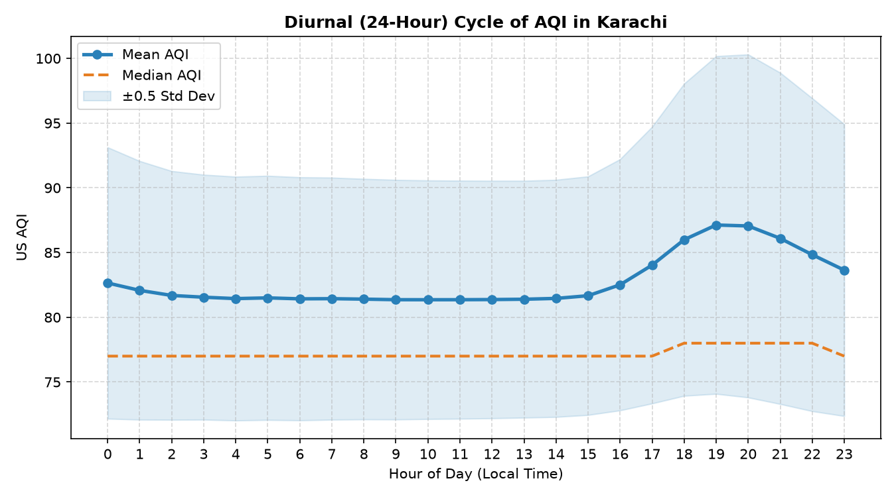
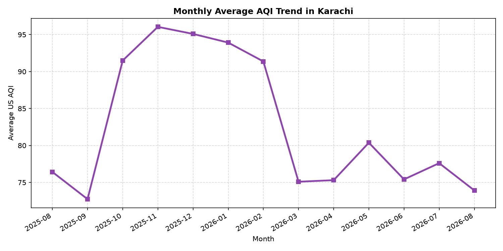
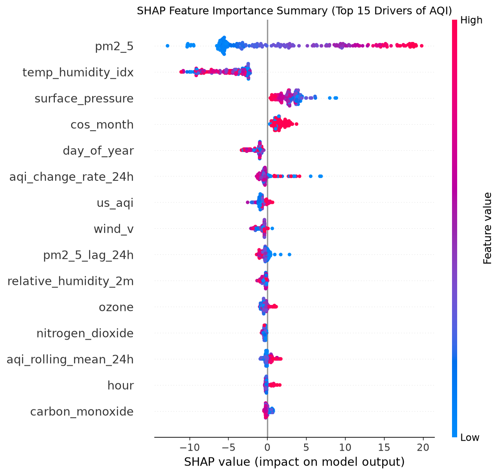

# Karachi Air Quality Index (AQI) - 3-Day Forecasting System

An end-to-end, 100% serverless machine learning system designed to forecast the Air Quality Index (AQI) for Karachi, Pakistan across 24-hour, 48-hour, and 72-hour horizons.

---

## 1. System Architecture

The project implements a decoupled, serverless machine learning architecture using GitHub Actions for compute, Open-Meteo for atmospheric data, DagsHub MLflow for experiment tracking and model registry, and Streamlit Community Cloud for the web dashboard.



---

## 2. Key Project Resources

* **Live Web Application**: [https://karachi-aqi-forecast-taha.streamlit.app/](https://karachi-aqi-forecast-taha.streamlit.app/)
* **DagsHub MLflow Tracking**: [https://dagshub.com/TahaZahid05/10pearls_AQI.mlflow](https://dagshub.com/TahaZahid05/10pearls_AQI.mlflow)
* **DagsHub Model Registry**: [https://dagshub.com/TahaZahid05/10pearls_AQI.mlflow/#/models/AQI_Predictor_Model](https://dagshub.com/TahaZahid05/10pearls_AQI.mlflow/#/models/AQI_Predictor_Model)
* **Target Coordinates**: Karachi, Pakistan (`Latitude: 24.8609`, `Longitude: 66.9905`, `Timezone: Asia/Karachi`)

---

## 3. Exploratory Data Analysis (EDA)

The dataset contains 9,360 continuous hourly observations from August 1, 2025 to August 28, 2026 for Karachi (Mean AQI: 82.77, Median: 77.00, Min: 38, Max: 208, Std: 20.72).

### 3.1 AQI Category Distribution
The dataset distribution across US EPA air quality index categories:



* **Moderate (51-100 AQI)**: Dominates the dataset with **7,820 hours (83.55%)**, representing Karachi's standard baseline air quality.
* **Unhealthy for Sensitive Groups (101-150 AQI)**: Accounts for **1,348 hours (14.40%)**, occurring primarily during stagnant weather windows.
* **Unhealthy (151-200 AQI)**: Occurs across **105 hours (1.12%)**, concentrated in winter thermal inversion events.
* **Good (0-50 AQI)**: Very rare for Karachi, accounting for only **79 hours (0.84%)**, occurring strictly during peak monsoon rainfall washouts.
* **Very Unhealthy (201-300 AQI)**: Recorded **8 hours (0.09%)**, with a dataset maximum of 208 AQI.

### 3.2 Feature Correlation Analysis
Pearson correlation coefficients ($r$) calculated across criteria pollutants and meteorological features with `us_aqi`:



* **PM2.5 ($r = +0.72$)**: Strongest single driver of the AQI index, followed by secondary combustion indicators Carbon Monoxide ($r = +0.40$) and Nitrogen Dioxide ($r = +0.39$).
* **Relative Humidity ($r = -0.39$)**: Negative correlation with AQI; higher maritime humidity in Karachi coincides with clean onshore sea breezes.
* **Wind Vector v ($r = -0.30$) & Wind Speed ($r = -0.24$)**: Negative correlation. Positive $v$ (southerly wind component blowing from the Arabian Sea) acts as a natural ventilation mechanism that disperses urban pollutants.
* **Surface Pressure ($r = +0.33$)**: Positive correlation; high barometric pressure stabilizes the lower troposphere and traps surface particulates.
* **PM10 ($r = +0.25$) & Ozone ($r = +0.36$)**: Secondary criteria pollutants contributing to the aggregate index.

### 3.3 Diurnal (24-Hour) Cycle
Hourly aggregation across all 9,360 hours shows a distinct daily pattern with a 5.77-point diurnal amplitude:



* **Midday Minimum (08:00 - 14:00)**: AQI reaches its lowest daily plateau (lowest mean: **81.36 AQI at 09:00**, median: 77.00) due to daytime solar heating driving vertical convective mixing and daytime sea breeze onset.
* **Evening Rush Hour Peak (17:00 - 21:00)**: AQI climbs sharply from 16:00 (82.51) to reach a peak at **19:00 (Mean: 87.13 AQI, Std: 26.09)** and **20:00 (Mean: 87.06 AQI, Std: 26.50)**, driven by heavy evening vehicular traffic combined with sunset boundary layer cooling and reduced surface wind speeds.
* **Nighttime Plateau (22:00 - 05:00)**: AQI gradually decays from 84.84 to ~81.50 through early morning as traffic clears.

### 3.4 Seasonal Trends
Monthly mean aggregation shows a substantial seasonal swing of 23.31 AQI points:



* **Winter Peak Pollution (October - February)**:
  * **November 2025**: Most polluted month (Mean: **96.05 AQI**, Median: 92.00, Std: 24.69).
  * **December 2025**: Mean: **95.10 AQI** (Dataset max standard deviation of 31.11).
  * **January 2026**: Mean: **93.92 AQI**.
  * **October 2025 & February 2026**: Mean: **91.49 AQI** and **91.37 AQI** respectively.
  * *Cause*: Winter continental winds from the north/northeast blow dry inland dust over Karachi while surface temperature inversions trap vehicular and industrial exhaust near ground level.
* **Monsoon / Summer Clean Period (March - September)**:
  * **September 2025**: Cleanest recorded month (Mean: **72.74 AQI**, Std: 13.85).
  * **August 2026 & August 2025**: Mean: **73.92 AQI** and **76.42 AQI** respectively.
  * **March - June**: Stable baseline between **75.10 and 77.61 AQI**.
  * *Cause*: Active Arabian Sea marine breeze circulation and summer monsoon precipitation scavenging disperse airborne particulates.

---

## 4. Feature Engineering Pipeline

The feature engineering module ([`src/feature_engineering.py`](src/feature_engineering.py)) transforms raw meteorological and pollutant time-series into model-ready features:

1. **Cyclical Temporal Encodings**:
   * Hour encodings: `sin_hour = sin(2 * pi * hour / 24)`, `cos_hour = cos(2 * pi * hour / 24)`
   * Day of week encodings: `sin_day_of_week = sin(2 * pi * day / 7)`, `cos_day_of_week = cos(2 * pi * day / 7)`
   * Month encodings: `sin_month = sin(2 * pi * month / 12)`, `cos_month = cos(2 * pi * month / 12)`
   * Preserves numerical continuity between cyclical boundaries (e.g. 23:00 to 00:00).

2. **Atmospheric Physics Features**:
   * **Wind Vector Decomposition**: Converts wind speed ($s$) and direction ($\theta$) into orthogonal Cartesian components:
     `wind_u = -s * sin(radians(theta))` (East-West)
     `wind_v = -s * cos(radians(theta))` (North-South)
   * **Temperature-Humidity Index**: Captures heat-moisture interaction:
     `temp_humidity_idx = temperature_2m * (relative_humidity_2m / 100)`

3. **Lag and Rolling Baselines**:
   * `aqi_rolling_mean_24h`: 24-hour moving average representing smooth background pollution.
   * `aqi_change_rate_24h`: Rate of pollution increase/decrease compared to the previous day.
   * `pm2_5_lag_24h`: Particulate concentration 24 hours prior.

4. **Multi-Horizon Forecast Targets**:
   * `target_aqi_24h`: AQI +24 hours ahead (Day 1)
   * `target_aqi_48h`: AQI +48 hours ahead (Day 2)
   * `target_aqi_72h`: AQI +72 hours ahead (Day 3)

---

## 5. Model Evaluation and Benchmark Leaderboard

Four model families were trained and evaluated on an 80/20 chronological time-series split (7,488 training hours, 1,872 test hours):

1. **Ridge Regression**: Linear baseline with L2 regularization (alpha = 1.0) and standard scaling.
2. **Random Forest Regressor**: Non-linear ensemble (100 estimators, max depth 12).
3. **LightGBM Regressor**: Gradient boosted decision trees (150 estimators, max depth 8, learning rate 0.05).
4. **Multi-Layer Perceptron (MLP)**: Neural network architecture (hidden layers: 64, 32, Adam optimizer, early stopping).

### Evaluation Results Table

| Model Family | Overall MAE | Overall RMSE | Day 1 (+24h) RMSE | Day 1 (+24h) R² | Day 2 (+48h) RMSE | Day 3 (+72h) RMSE |
| :--- | :---: | :---: | :---: | :---: | :---: | :---: |
| **LightGBM** | **4.89** | **6.58** | **5.11** | **0.455** | **6.81** | **7.58** |
| **Random Forest** | 5.00 | 6.66 | 5.31 | 0.413 | 6.97 | 7.50 |
| **Ridge Regression** | 5.55 | 7.10 | 5.62 | 0.342 | 7.43 | 8.02 |
| **Neural Network (MLP)** | 9.03 | 11.55 | 7.93 | -0.311 | 11.05 | 14.68 |

### Key Findings:
* **LightGBM is the winning model**, achieving the lowest error across all metrics (Overall MAE = 4.89 AQI points, Day 1 RMSE = 5.11).
* **Tree-based gradient boosting outperformed the neural network**, as tabular meteorological data exhibits non-linear threshold behaviors (e.g. wind direction shifts) that tree splits model more effectively than dense linear layers.
* **Short-term accuracy is high**: Day 1 predictions are within +/- 3.93 AQI points on average. Day 3 predictions remain within +/- 5.68 points, maintaining accuracy within the same EPA health category.

---

## 6. Model Explainability (SHAP Analysis)

SHAP (SHapley Additive exPlanations) values were computed on the test set using `shap.TreeExplainer` for the winning LightGBM model:



### Physical Interpretation:
1. **PM2.5 and PM10**: Primary positive drivers (r = +0.97). Higher current particulate matter shifts future AQI predictions higher due to pollution inertia.
2. **Wind Vector v**: Strong negative impact. Southerly maritime winds reduce predicted AQI by dispersing coastal pollution.
3. **Surface Pressure and Temperature**: Higher atmospheric pressure and heat increase predicted AQI by indicating stagnant air masses and enhanced photochemical smog formation.
4. **Time of Day (cos_hour)**: Mathematical peaks between midnight and 06:00 AM push predicted AQI higher, reflecting nocturnal atmospheric inversion trapping.

---

## 7. CI/CD Automation Architecture

The system is fully automated using GitHub Actions workflows:

### 7.1 Hourly Feature Pipeline ([`.github/workflows/feature_pipeline.yml`](.github/workflows/feature_pipeline.yml))
* **Trigger**: Scheduled hourly (`cron: '0 * * * *'`) and manual dispatch (`workflow_dispatch`).
* **Tasks**:
  1. Sets up Python 3.11 environment.
  2. Executes `python -m src.backfill` to fetch latest observations from Open-Meteo.
  3. Computes updated rolling baselines and feature vectors.
  4. Automatically commits updated [`data/historical_features.parquet`](data/historical_features.parquet) back to the repository using `github-actions[bot]`.

### 7.2 Daily Training & Registry Pipeline ([`.github/workflows/training_pipeline.yml`](.github/workflows/training_pipeline.yml))
* **Trigger**: Scheduled daily at 00:00 UTC (`cron: '0 0 * * *'`) and manual dispatch (`workflow_dispatch`).
* **Tasks**:
  1. Checks out repository and installs dependencies.
  2. Authenticates with DagsHub MLflow via `DAGSHUB_USER_TOKEN` secret.
  3. Executes `python -m src.train` to train and evaluate all 4 model families.
  4. Logs metrics, parameters, and SHAP plots to DagsHub MLflow tracking.
  5. Registers the winning LightGBM model version into DagsHub Model Registry (`AQI_Predictor_Model`).

---

## 8. Web Application Dashboard

The interactive web dashboard ([`app/streamlit_app.py`](app/streamlit_app.py)) is deployed live at **[https://karachi-aqi-forecast-taha.streamlit.app/](https://karachi-aqi-forecast-taha.streamlit.app/)**:

* **Dynamic Model Loading**: Connects to DagsHub Model Registry over HTTPS to pull the latest production model version (`v5`) on startup, with local fallback.
* **Real-time Observations**: Queries Open-Meteo on-demand (with 30-minute caching) to display current Karachi AQI and weather parameters.
* **3-Day Forecast Cards**: Displays predicted AQI for Day 1 (+24h), Day 2 (+48h), and Day 3 (+72h) with EPA color-coded badges.
* **Automated Health Alerts**: Triggers warning banners when forecasted AQI exceeds 100 (*Sensitive Groups*) or 150 (*Unhealthy*).
* **Interactive Trajectory Curve**: Plotly graph showing past 72-hour actual AQI transitioning into the 3-day forecast line with EPA benchmark bands.
* **SHAP Breakdown**: Embedded feature importance chart explaining the atmospheric drivers behind the forecast.

---

## 9. Project Directory Structure

```
├── .github/
│   └── workflows/
│       ├── feature_pipeline.yml   # Hourly data ingestion & feature update
│       └── training_pipeline.yml  # Daily model retraining & registry push
├── app/
│   └── streamlit_app.py          # Interactive Streamlit dashboard
├── data/
│   └── historical_features.parquet # Clean 1-year training dataset (9,360 rows)
├── models/
│   └── best_model.pkl             # Trained LightGBM model bundle
├── plots/
│   ├── eda_aqi_distribution.png   # EPA category distribution
│   ├── eda_correlation_heatmap.png# Feature correlation matrix
│   ├── eda_diurnal_cycle.png      # 24-hour diurnal cycle curve
│   ├── eda_seasonal_trends.png    # Monthly seasonal trend curve
│   └── shap_summary.png           # SHAP beeswarm feature importance
├── src/
│   ├── __init__.py
│   ├── backfill.py                # Historical data backfill and update script
│   ├── config.py                  # API endpoints, coordinates, target horizons
│   ├── data_fetcher.py            # Open-Meteo air quality & weather fetcher
│   ├── eda.py                     # EDA visualization generator
│   ├── feature_engineering.py     # Feature engineering & physics calculations
│   └── train.py                   # Multi-model training, evaluation, & MLflow logging
├── .gitignore
├── README.md                      # Project documentation and final technical report
└── requirements.txt               # Project dependencies
```

---

## 10. Local Setup & Reproduction

### Prerequisites
* Python 3.11+
* Git

### Installation

1. Clone the repository:
   ```bash
   git clone https://github.com/TahaZahid05/10pearls_AQI.git
   cd 10pearls_AQI
   ```

2. Create and activate a virtual environment:
   ```bash
   python3.11 -m venv .venv
   source .venv/bin/activate
   ```

3. Install dependencies:
   ```bash
   pip install -r requirements.txt
   ```

### Running the Pipelines

* **Run Historical Backfill**:
  ```bash
  python -m src.backfill
  ```

* **Generate EDA Plots**:
  ```bash
  python -m src.eda
  ```

* **Train Models & Log to DagsHub MLflow**:
  ```bash
  export DAGSHUB_USER_TOKEN="your_dagshub_token"
  python -m src.train
  ```

* **Launch the Streamlit Dashboard Locally**:
  ```bash
  streamlit run app/streamlit_app.py
  ```
  Open `http://localhost:8501` in your browser.
